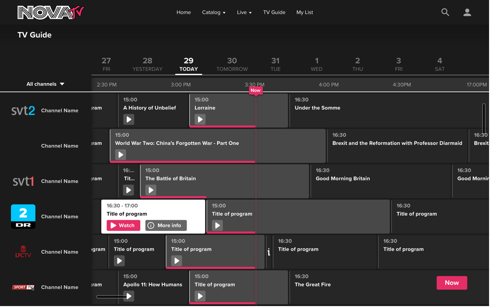

    

<h4 align="center">
    Simplestream Laravel Code Challenge
</h4>

| Role            	| Senior Laravel Developer Role  	|
|-----------------	|--------------------------------	|
| Team            	| Backend (Web) Development Team 	|
| Reports To      	| Head of Software Development   	|
| Time Allocation 	| 45 min                         	|

## Overview

The purpose of this code test is to help us understand your style of coding, technical proficiency and decision-making process.

We are looking at how you approach a problem and how closely you can follow a specification. Remember to show off your ability to write readable code that is maintainable and scalable.

If you struggle with understanding the requirements, please forward your questions to your interviewer, so that we can assist you.

## Requirements

You are required to build a simple API in Laravel 8 that allows frontend apps to display an electronic programming guides (EPG); please see a screenshot below of an example of frontend EPG. You will not be required to build the frontend EPG; only the API.

    

You will need to develop two API endpoints

<dl>
    <dt>GET List of channels</dt>
    <dd>Url /channels</dd>
</dl>

<dl>
    <dt>GET Programme timetable for a selected channel, for a selected date and timezone.</dt>
    <dd>Url /channels/{channel-uuid}/{date}/timezone/{timezone}</dd>
</dl>

Each endpoint must provide the following information in their responses.

Channels
- Unique identifier
- Channel name
- Channel icon

Programme timetable
- Unique identifier
- Programme name
- Start time
- End time
- Duration (in seconds)

## Submission Rules

1. Download this repository and create a new repository in your own GitHub account (**Don't Fork this repository!**). Create a new branch for the code challenge and do your changes on the branch. When you are done, please create pull requests for your changes into main (**Without merging!**) so we can review the pull requests.
2. There are many different possible solutions and approaches to implement the architecture. We are not looking a specific solution but instead are more interested in your approach, how you've implemented your solution and how you structure & format your code.
3. You should try to follow SOLID principles as a general guideline.
4. All code **MUST** be formatted to [PSR12 coding style guidelines](https://www.php-fig.org/psr/psr-12/).
5. Please include docblocks for your methods and comment only where necessary.
6. Once completed, please send your repo url for review.
